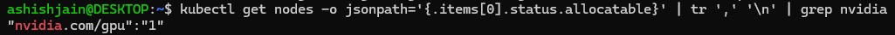
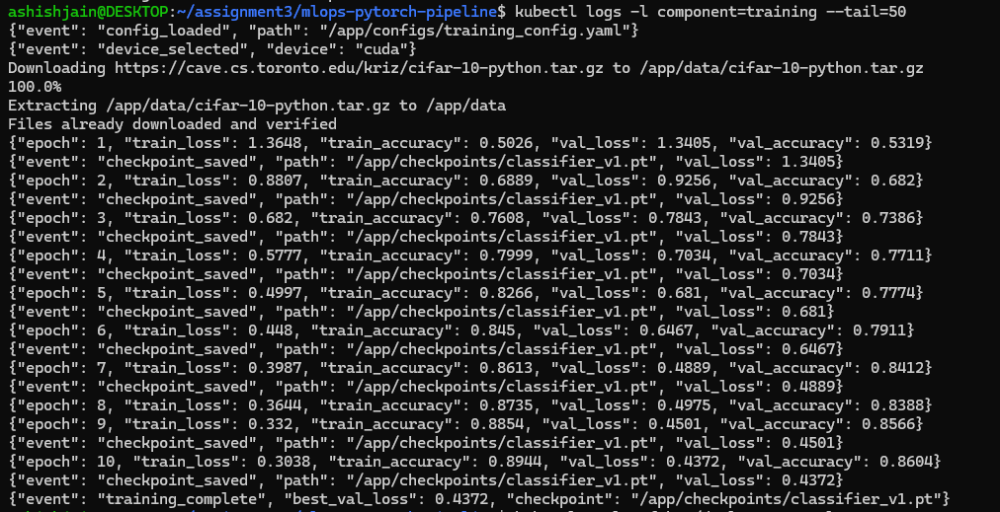
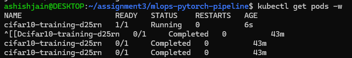
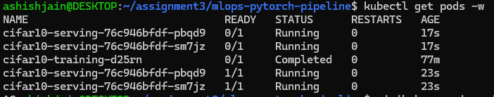
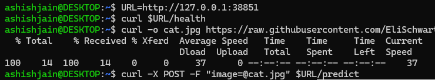
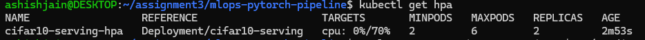
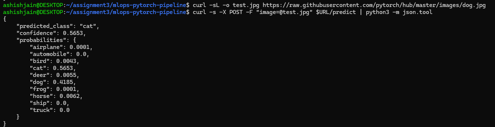

# MLOps PyTorch Pipeline — CIFAR-10 on Docker & Kubernetes

An end-to-end MLOps pipeline that trains a PyTorch CIFAR-10 image classifier and
serves it for inference, containerized with Docker and orchestrated on
Kubernetes (Minikube) with **GPU-accelerated training**.

## Architecture

```
                          ┌─────────────────────────────────────────────┐
                          │            Kubernetes (Minikube)             │
                          │                                              │
   docker build          │   ┌────────────────┐     ┌────────────────┐  │
  ┌──────────────┐        │   │  ConfigMap     │     │      PVC       │  │
  │ Dockerfile.  │        │   │ training-config│     │ model-         │  │
  │   train      ├───────────▶│  (hyperparams) │     │ checkpoints    │  │
  └──────────────┘  image │   └───────┬────────┘     └───┬────────┬───┘  │
                          │           │ mount            │ write  │ read │
  ┌──────────────┐        │   ┌───────▼──────────────────▼──┐     │      │
  │ Dockerfile.  │  image │   │      Training Job (GPU)      │     │      │
  │   serve      ├───────────▶│  nvidia.com/gpu: 1           │     │      │
  └──────────────┘        │   │  src/train.py → classifier.pt│     │      │
                          │   └──────────────────────────────┘     │      │
                          │                                        │      │
                          │   ┌────────────────────────────────────▼───┐  │
                          │   │      Serving Deployment (2 replicas)    │  │
                          │   │  src/serve.py  FastAPI  /predict /health│  │
                          │   │  liveness + readiness probes            │  │
                          │   └───────────────┬─────────────────────────┘  │
                          │                   │                            │
                          │        ┌──────────▼──────────┐   ┌──────────┐  │
                          │        │  Service (NodePort) │   │   HPA    │  │
                          │        │      :30080         │   │  2 → 6   │  │
                          │        └──────────┬──────────┘   └──────────┘  │
                          └───────────────────┼────────────────────────────┘
                                              │
                                       curl /predict
                                       (client)
```

**Flow:** the training Job (on GPU) reads hyperparameters from the ConfigMap,
trains a ResNet-18, and writes the checkpoint to the PVC. The serving Deployment
mounts the same PVC read-only, loads the checkpoint, and exposes `/predict` and
`/health` behind a NodePort Service. An HPA scales serving replicas on CPU load.

## Repository structure

```
├── src/                    # model, dataset, training, serving code
│   ├── model.py            # get_model(): ResNet-18 (CIFAR-adapted) + SimpleCNN
│   ├── dataset.py          # CIFAR-10 loaders + transforms
│   ├── train.py            # config-driven training, checkpointing, early stop
│   └── serve.py            # FastAPI inference server
├── configs/training_config.yaml
├── docker/
│   ├── Dockerfile.train    # multi-stage CUDA 12.1 training image
│   └── Dockerfile.serve    # slim non-root serving image
├── k8s/
│   ├── configmap.yaml      # hyperparameters
│   ├── pvc.yaml            # shared checkpoint volume
│   ├── training-job.yaml   # GPU training Job
│   ├── deployment.yaml     # 2-replica serving Deployment
│   ├── service.yaml        # NodePort Service
│   └── hpa.yaml            # HorizontalPodAutoscaler
├── tests/test_model.py
├── requirements/           # pinned train.txt and serve.txt
└── .github/workflows/ci.yml
```

## Prerequisites

- Docker (native engine in WSL2 recommended for GPU)
- Minikube + kubectl
- NVIDIA GPU + driver + NVIDIA Container Toolkit (for GPU training)

## Setup & run

### 1. Start Minikube with GPU
```bash
minikube start --driver=docker --container-runtime=docker --gpus all
minikube addons enable nvidia-device-plugin
# verify the GPU is schedulable:
kubectl get nodes -o jsonpath='{.items[0].status.allocatable}' | tr ',' '\n' | grep nvidia
# → "nvidia.com/gpu":"1"
```

### 2. Build images into Minikube's Docker
```bash
eval $(minikube docker-env)
docker build -f docker/Dockerfile.train -t mlops-train:v1 .
docker build -f docker/Dockerfile.serve -t mlops-serve:v1 .
```

### 3. Deploy config + storage, then train (GPU)
```bash
kubectl apply -f k8s/configmap.yaml
kubectl apply -f k8s/pvc.yaml
kubectl apply -f k8s/training-job.yaml
kubectl logs -f -l component=training      # shows {"device": "cuda"} + epoch metrics
```

### 4. Deploy serving + service
```bash
kubectl apply -f k8s/deployment.yaml
kubectl apply -f k8s/service.yaml
kubectl get pods -w                        # wait for 2 serving pods 1/1
```

### 5. Test inference
```bash
minikube service cifar10-serving --url     # prints the URL
curl <url>/health
curl -X POST -F "image=@cat.jpg" <url>/predict
```

### 6. Autoscaling (bonus)
```bash
minikube addons enable metrics-server
kubectl apply -f k8s/hpa.yaml
kubectl get hpa
```

## Results

- **Training:** ResNet-18, 10 epochs on GPU (RTX 3060), final **validation
  accuracy 0.8604** (best val_loss 0.4372).
- **GPU confirmed:** training logs report `{"event": "device_selected",
  "device": "cuda"}`; the node advertises `nvidia.com/gpu: 1`.
- **Serving:** 2 replicas, both `1/1 Ready`; `/predict` returns the predicted
  class with per-class probabilities.
- **Autoscaling:** HPA active, scaling 2→6 on 70% CPU.

## Design decisions

- **GPU for training, CPU for serving.** The node has one physical GPU, reserved
  for the training Job where acceleration matters. Two GPU-requesting serving
  replicas could not both schedule on a single-GPU node, and ResNet-18 inference
  on 32×32 images is sub-millisecond on CPU.
- **Multi-stage Docker builds** separate the heavy dependency layer from the
  source layer, so code changes rebuild only a small layer.
- **ConfigMap + PVC** decouple hyperparameters from the image and share the
  trained checkpoint between the training Job and serving Deployment.

## Testing

```bash
pytest -v          # model factory + output-shape tests (also run in CI)
```

## Validation

End-to-end validation of the deployed pipeline (full terminal log in
[`docs/complete-terminal-run.txt`](docs/complete-terminal-run.txt)).

### 1. GPU schedulable on the node
The cluster advertises the GPU as an allocatable resource.



### 2. GPU training — device cuda, 10 epochs
The training Job runs on the GPU (`"device": "cuda"`) and trains to
**val_accuracy 0.8604**.



### 3. Training Job running


### 4. Training complete, serving replicas ready
The training pod reaches `Completed`; both serving replicas are `1/1`.



### 5. Health endpoint


### 6. Autoscaling (HPA)
The HorizontalPodAutoscaler tracks CPU and manages 2–6 replicas.



### 7. Inference — /predict
A dog image returns `cat` (0.565) and `dog` (0.419) as the top two classes,
consistent with CIFAR-10 cat/dog confusion at ~86% accuracy.


